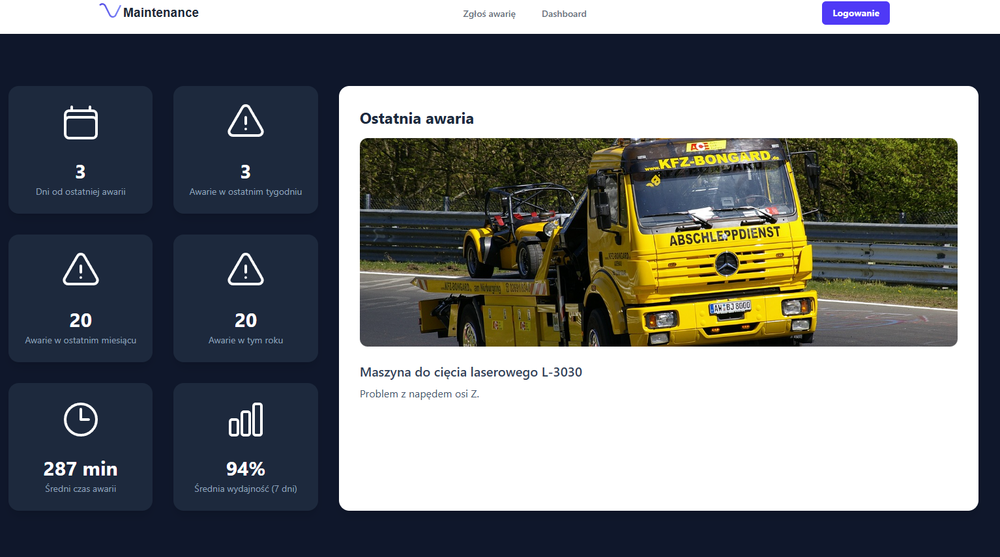
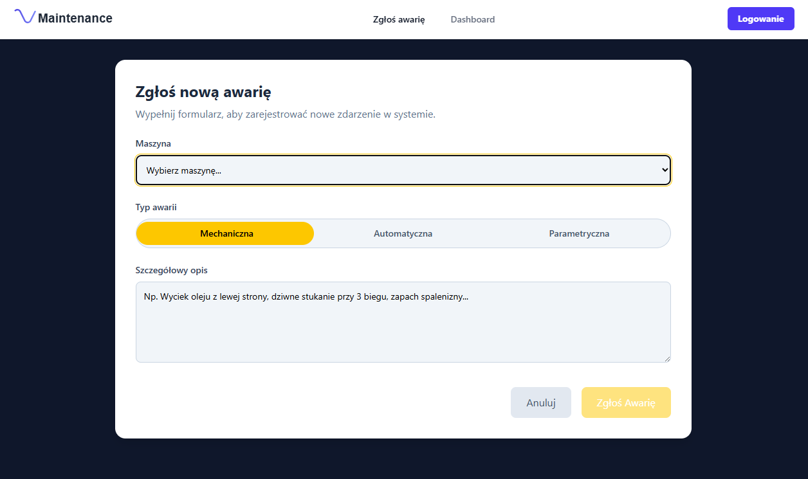
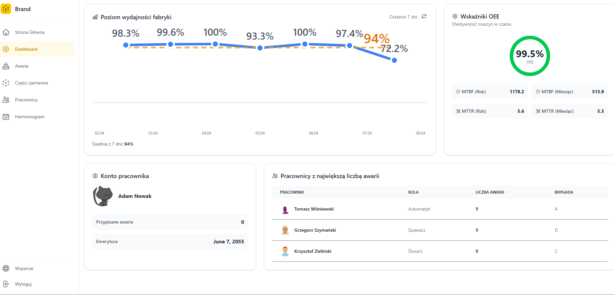
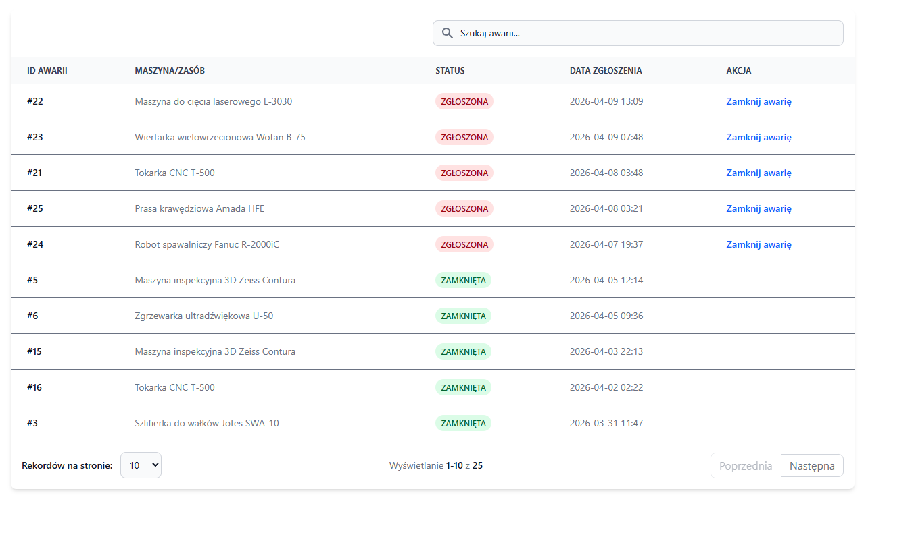
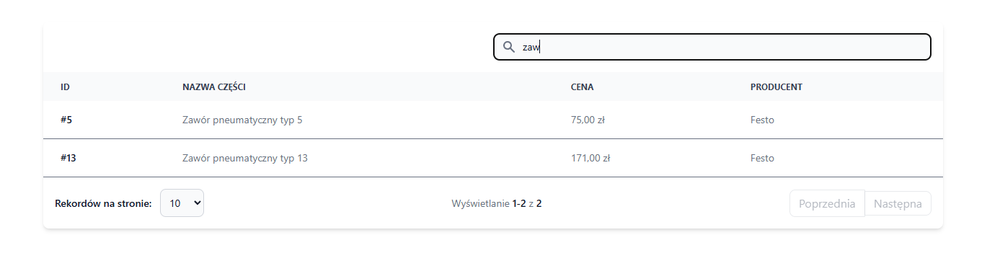
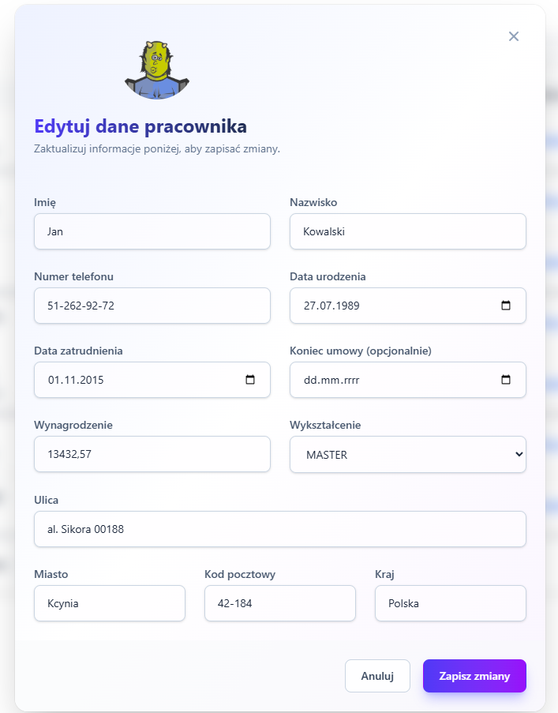
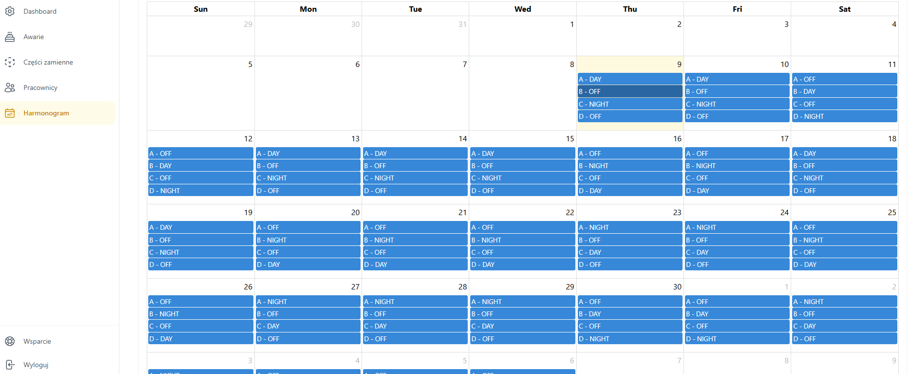
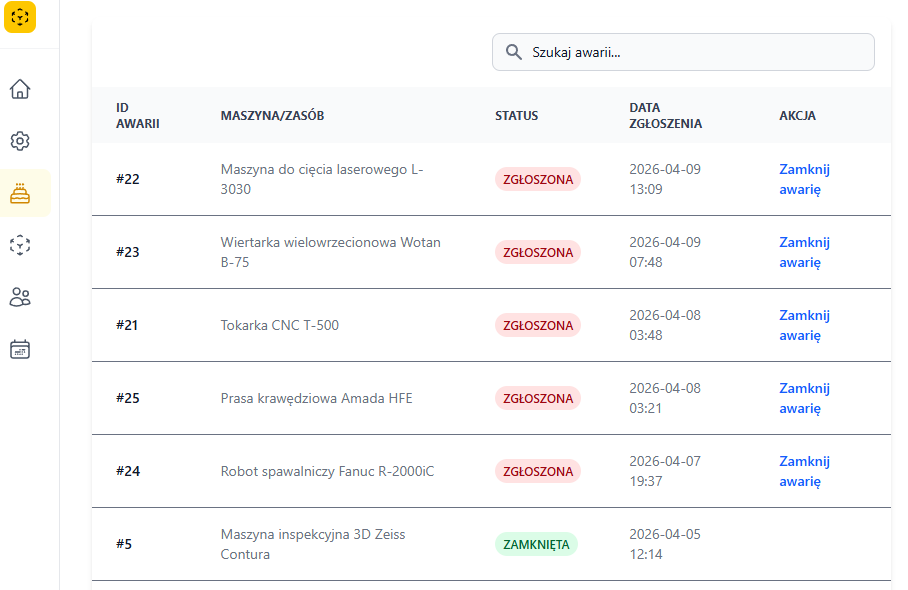

# CMMS Lite — Lightweight Maintenance Management System

> A full-stack web application for managing maintenance operations in industrial facilities. Designed to streamline breakdown reporting, spare parts inventory, workforce management, and shift scheduling — all in one place.

---

## Overview

**CMMS Lite** is a portfolio project that simulates a real-world Computerized Maintenance Management System used in manufacturing environments. The system supports the full lifecycle of a breakdown event — from anonymous reporting on the shop floor, through assignment and resolution by a technician, to historical analysis and KPI reporting for management.

---

## Screenshots

### Public Home — Live KPIs & Quick Breakdown Reporting


> The public-facing home page displays real-time factory statistics (downtime days, weekly/monthly breakdowns, average repair time, efficiency) and highlights the most recent incident. No login required to report a breakdown.

---

### Breakdown Reporting Form


> Any operator on the floor can report a new breakdown by selecting the machine, choosing the fault type (Mechanical / Automatic / Parametric), and providing a detailed description. The form is intentionally simple and accessible without authentication.

---

### Authentication


> JWT-based authentication with role-based access control. Three distinct roles are supported: `ADMIN`, `TECHNICIAN`, and `SUBCONTRACTOR`, each with a different scope of permissions across the system.

---

### Dashboard — Performance Analytics


> The authenticated dashboard provides a comprehensive overview of factory performance. Key metrics include a 7-day efficiency trend chart, OEE indicator, MTBF and MTTR values, the current user's assigned breakdowns, and a ranking of technicians by incident count.

---

### Breakdown Management


> A paginated, searchable list of all reported breakdowns. Each entry shows the machine, current status (`REPORTED` / `CLOSED`), and reporting date. Technicians can close open breakdowns directly from this view.

---

### Spare Parts Inventory


> A searchable catalogue of spare parts with pricing and manufacturer information. Inventory is automatically updated when parts are assigned to breakdown work orders, and total repair costs are calculated accordingly.

---

### Employee Management


> Full employee profile management including personal data, contact details, employment contract dates, salary, education level, and address. Profiles are linked to breakdown assignments and shift schedules.

---

### Shift Schedule — Brigade Calendar


> Automated generation of multi-brigade shift schedules (A/B/C/D brigades, DAY / NIGHT / OFF rotations) visualized on a full monthly calendar powered by FullCalendar. Schedules can be generated and viewed for any time period.

### Mobile View


> The interface is fully responsive. On smaller screens the sidebar collapses to an icon-only rail, tables reflow to accommodate narrower viewports, and all interactions remain accessible on touch devices.

---

## Tech Stack

### Backend
| Technology | Version | Purpose |
|---|---|---|
| Java | 17 | Core language |
| Spring Boot | 3.5.4 | Application framework |
| Spring Security + JWT | 6.5 / 0.12.6 | Authentication & authorization |
| Spring Data JPA + Hibernate | 3.5 / 6.6 | ORM & data persistence |
| PostgreSQL | — | Production database |
| H2 | — | In-memory database (dev profile) |
| Flyway | 11.x | Database migrations |
| MapStruct | 1.6.3 | DTO ↔ Entity mapping |
| Lombok | 1.18.38 | Boilerplate reduction |
| SpringDoc OpenAPI | 2.8.9 | Interactive API documentation |
| JavaFaker | 1.0.2 | Sample data seeding (dev) |

### Frontend
| Technology | Version | Purpose |
|---|---|---|
| Angular | ~20.2.1 | SPA framework |
| Tailwind CSS | ~4.1.11 | Utility-first styling |
| FullCalendar | ~6.1.19 | Shift schedule calendar |
| ngx-toastr | ~19.0.0 | Notifications |
| ng-icons | ~32.1.0 | Icon library |
| OpenAPI Generator CLI | ~2.21.4 | Type-safe API client generation |

### Infrastructure
- **Docker & Docker Compose** — containerized deployment
- **Maven** — backend build tool

---

## Architecture

### Backend — Feature-Slice / Domain-Driven

Each domain module contains its own `controller`, `dto`, `entity`, `mapper`, `repository`, `service`, and `exception` packages:

```
com.cmms.lite
├── breakdown         # Full breakdown lifecycle: report → assign → close → cost
├── breakdownType     # Fault categories: MECHANICAL, AUTOMATIC, PARAMETRIC
├── config            # App config, dev data seeding (JavaFaker)
├── employee          # Employee profiles, roles, brigade assignment
├── exception         # Global exception handler, custom exceptions
├── machine           # Machine/equipment CRUD
├── security          # JWT filter, UserDetailsService, RBAC config
├── shiftSchedule     # Brigade rotation generation & calendar API
└── sparePart         # Spare parts inventory & usage tracking
```

### Frontend — Modular Angular

```
src/app
├── core/             # Guards, interceptors, generated API client
├── features/         # Business modules (dashboard, home)
├── layout/           # Structural components (nav, sidebar)
└── shared/           # Reusable UI components (modals, tables)
```

---

## Getting Started

### Prerequisites

- Java 17+
- Node.js 18+
- Docker & Docker Compose
- Maven

### Run with Docker

```bash
git clone https://github.com/gruchh/MaintenanceCMMSLite.git
cd MaintenanceCMMSLite
docker-compose up --build
```

| Service | URL |
|---|---|
| Frontend | http://localhost:4200 |
| Backend API | http://localhost:8080 |
| API Documentation | http://localhost:8080/swagger-ui-custom.html |

### Run Locally (without Docker)

**Backend:**
```bash
cd backend
./mvnw spring-boot:run -Dspring.profiles.active=dev
```

**Frontend:**
```bash
cd frontend
npm install
npm start
```

> The `dev` profile uses an H2 in-memory database and automatically seeds realistic sample data via `DataInitializer` + JavaFaker on every startup.

### Generate API Client (after backend changes)

```bash
# From local backend
npm run api:generate:dev

# From Docker
npm run api:generate:docker
```

---

## Key Features

- **Breakdown lifecycle management** — from anonymous field report to full resolution with cost tracking
- **Role-Based Access Control** — three roles (`ADMIN`, `TECHNICIAN`, `SUBCONTRACTOR`) with granular endpoint permissions
- **Performance analytics** — OEE, MTBF, MTTR, weekly efficiency trends
- **Automated shift scheduling** — multi-brigade (A/B/C/D) rotation calendar
- **Spare parts inventory** — searchable catalogue with automatic usage logging and cost calculation
- **Type-safe API client** — Angular client auto-generated from OpenAPI spec
- **Dual database support** — H2 for development, PostgreSQL for production
- **Database migrations** — managed by Flyway for safe, versioned schema evolution
- **Responsive UI** — fully functional on mobile and tablet with collapsible sidebar navigation
- **Containerized** — full Docker Compose setup for one-command deployment

---

## License

This project is licensed under the MIT License. See [LICENSE](LICENSE) for details.
